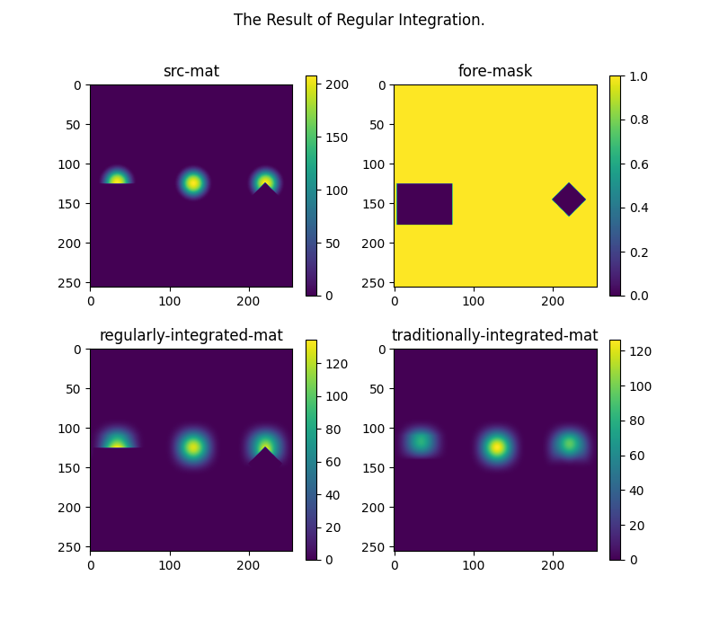

# regular-integration (領域正規な空間積分)

前景領域のみを計算ドメインとした画像上の空間積分フィルタ．



## 使い方

lib_regular_integration.py の 

```python
if __name__ == '__main__':
```

以下が使用例です．  
また，普通に

```cmd
python lib_regular_integrate.py 
```

を実行するとサンプルが走ります．